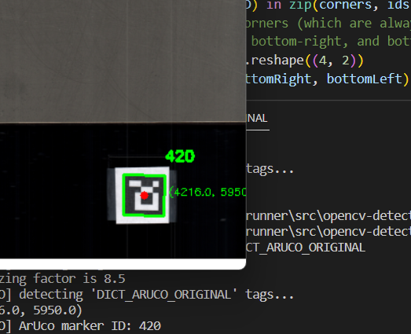

# Ahead Wind
Ahead Wind is a pre-seed stage 3d printing software startup based in Denver, CO. I met them through Twitter thanks to Mo Mahmood.

## Work I did
All the software was written in Python.

### Dual sensor housing and mounting

### Establishing coordinate system

#### ArUco

### Calibration sequence

### Paraview image stacking

{: .fs-6 .fw-300 }