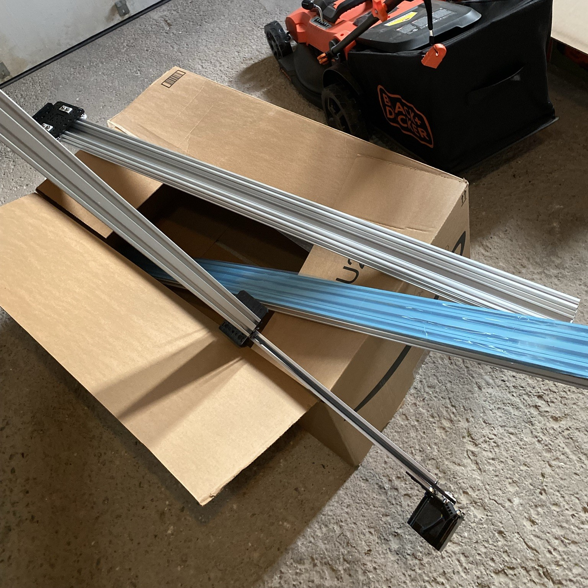
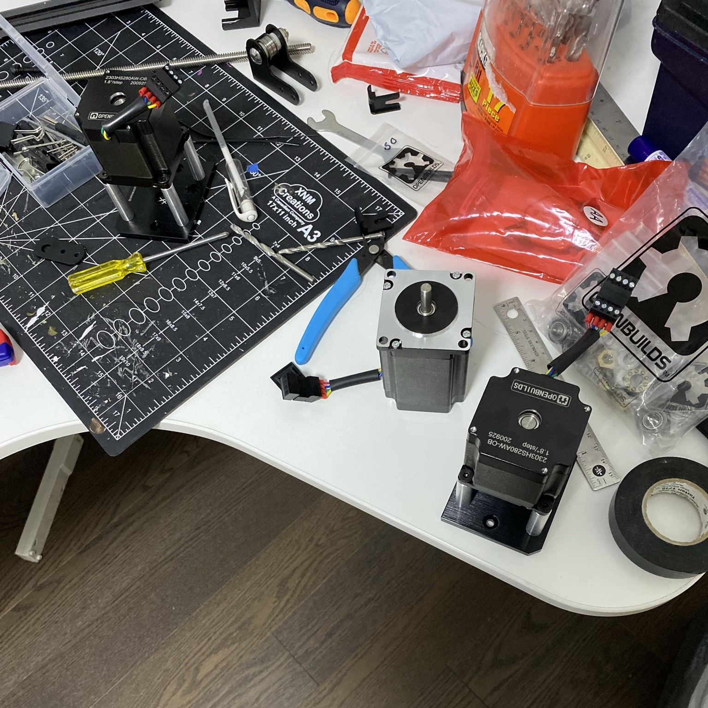

## Concrete 3D Printer
This was asbolutely my first attempt at a hardware project. My friend Sigil Wen encouraged me to go and startup with the idea I had been thinking about for a few months: concrete 3d printing for fixing the housing problem.
[Read more about it here]({{site.baseurl}}/docs/startups).

### Open Builds Gantry - July 2021

### Screw Extruder

### Pressure Fed System

### Duet 4 6HC Electronics - August 2021
I know this is a pricey control board. Yet it was a very open and easy to use option.

{: .fs-6 .fw-300 }