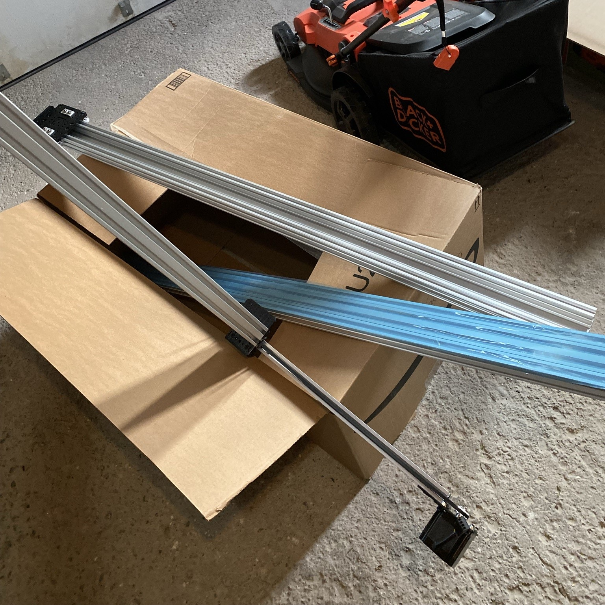
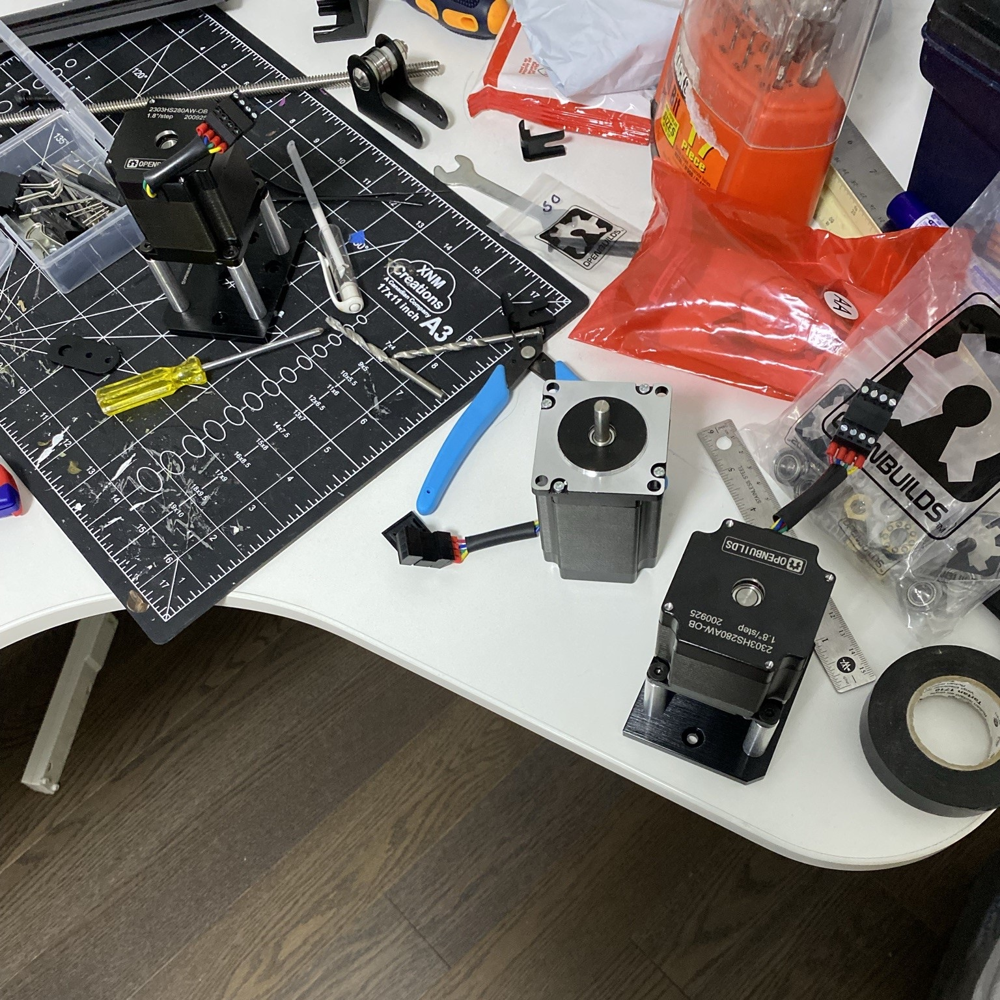

## Where it all began
This was asbolutely my first attempt at a hardware project. My friend Sigil Wen encouraged me to go and startup with the idea I had been thinking about for a few months: concrete 3d printing for fixing the housing problem.
[Read more about it here]({{ '/startups/' | relative_url }}).

### Open Builds Gantry - July 2021
I bought a bunch of long actuators, extrusion, and gantry plates from [Maker Parts](https://makerparts.ca/), which is an OpenBuilds reseller in Canada.

### Screw Extruder
A screw extruder attached to a geared down stepper motor pushes the concrete out a metal nozzle.

### Pressure Fed System
The system is pressure-fed. Pretty much took an air compressor to one volume of the tank and the bulk head in the middle pushes the concrete out the other end.

### Duet 4 6HC Electronics - August 2021
I know this is a pricey control board. Yet it was a very open and easy to use option.

### CAD
I'm not gonna lie. This was the first time I made something in CAD. I didn't get very far. But I'd like to show what I did even though it is extremely embarassing.

  

    
  

  

    
  

{: .fs-6 .fw-300 }