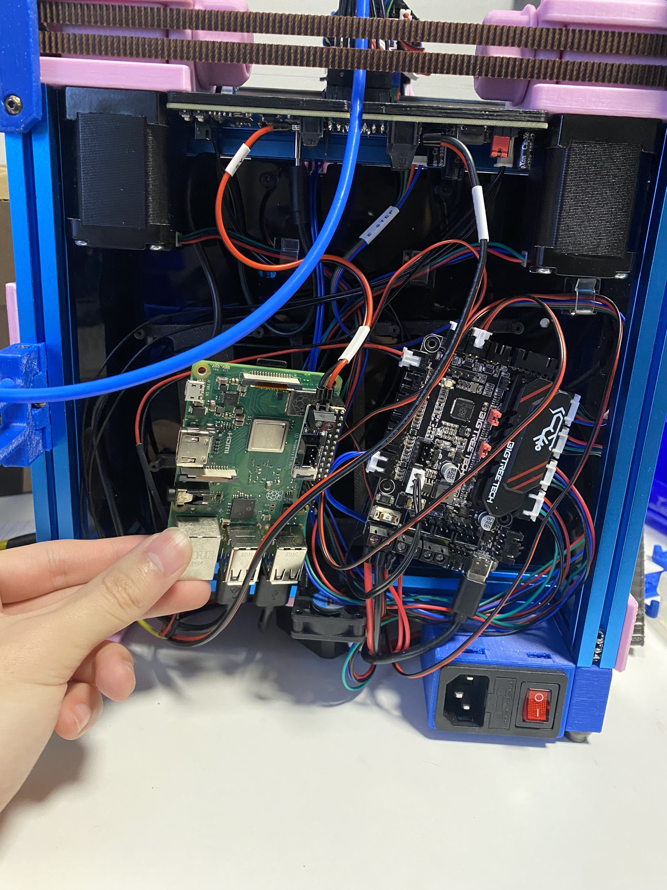

## Voron 0.1 - 2021
I started with a Fabreeko kit. It was a pre-order and their first batch. I somehow bought into the hype. Building a 3d printer with documentation is really not hard. The hard part is to be able to smooth over undocumented problems. Probably 8 times out of 10 you won't have any problems following a guide. But when that guide is not all inclusive, you need to improvise.
Different kits have different wiring, different hardware, and possibly different control boards. It's kinda up to you to build it after ordering everything.

### First Print

## 0.1 -> 0.2 Conversion - Sept 2023

## Redoing the electronics - Dec 2023

{: .fs-6 .fw-300 }